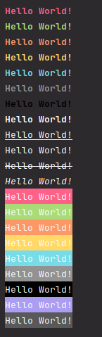

# Styling Plus Plus

Easy to use styling that you can use in your C++ projects.

## How to use

Not sure yet.

## Features

### Text colouring

| Colour  | Function           |
|---------|--------------------|
| Red     | txtred(string)     |
| Green   | txtgreen(string)   |
| Blue    | txtblue(string)    |
| Yellow  | txtyellow(string)  |
| Cyan    | txtcyan(string)    |
| Magenta | txtmagenta(string) |
| White   | txtwhite(string)   |
| Black   | txtblack(string)   |

### Text decoration

| Colour    | Function             |
|-----------|----------------------|
| Underline | txtunderline(string) |
| Bold      | txtbold(string)      |
| Italic    | txtitalic(string)    |

### Text background colouring

| Colour  | Function          |
|---------|-------------------|
| Red     | bgred(string)     |
| Green   | bggreen(string)   |
| Blue    | bgblue(string)    |
| Yellow  | bgyellow(string)  |
| Cyan    | bgcyan(string)    |
| Magenta | bgmagenta(string) |
| White   | bgwhite(string)   |
| Black   | bgblack(string)   |

## Example

### Code snippet

```cpp
    #include <iostream>
    #include <string>
    #include "stylingplusplus.h"

    int main() {
        txtred("Hello World!");
        txtgreen("Hello World!");
        txtblue("Hello World!");
        txtyellow("Hello World!");
        txtcyan("Hello World!");
        txtwhite("Hello World!");
        txtblack("Hello World!");
        txtbold("Hello World!");
        txtunderline("Hello World!");
        txtblink("Hello World!");
        txtlinethrough("Hello World!");
        textitalic("Hello World!");
        
        bgred("Hello World!");
        bggreen("Hello World!");
        bgblue("Hello World!");
        bgyellow("Hello World!");
        bgcyan("Hello World!");
        bgwhite("Hello World!");
        bgblack("Hello World!");
        bgmagenta("Hello World!");
        bggrey("Hello World!");
        return 0;
    }
```

### Image

